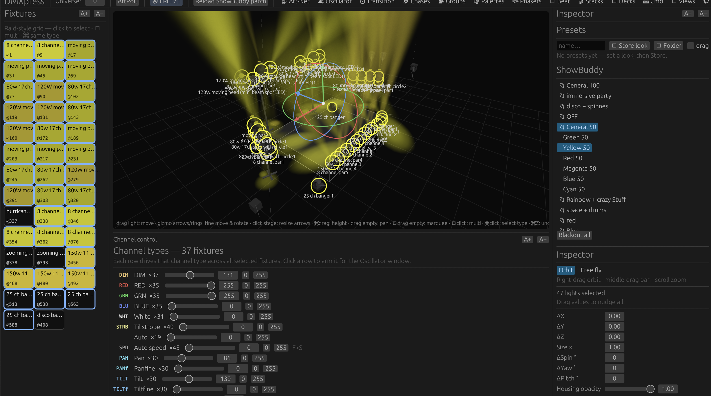
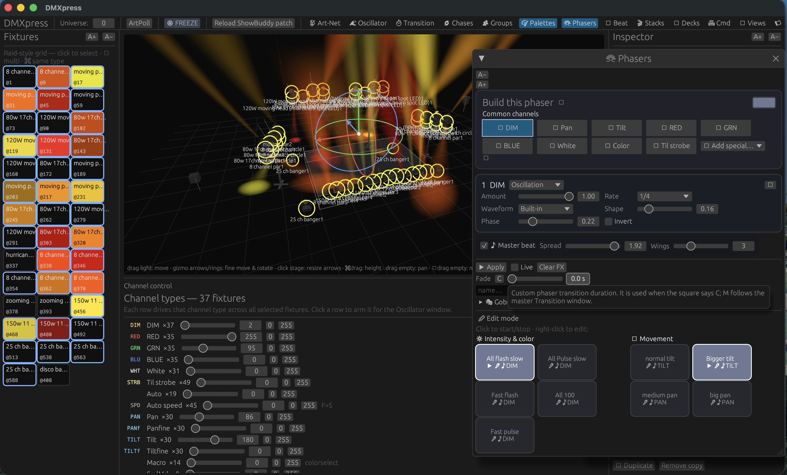

# DMXpress

A native, all-in-one DMX fixture visualizer and live lighting controller built in Rust.

DMXpress is intended to make better-than-average light shows approachable without requiring a full-size professional console. It combines fixture patching, programming, reusable looks, effects, cue playback, output, and 3D visualization in one desktop application.

> **Project status:** DMXpress is under active development. Interfaces, file formats, and workflows may change.

## Showcase

### Building a starting position

Select the full rig, apply an `All 50` starting look, then shape the scene with pan and tilt controls while watching the result in the 3D visualizer.



### Running phasers

The same rig in motion with two phasers active: an intensity phaser and a larger tilt movement phaser. The phaser editor remains open beside the live 3D result for immediate adjustment.



## Features

- **Programmer** for direct, temporary fixture control
- **Fixture groups** for reusable selections
- **Palettes** for color, position, dimmer, beam, focus, and control values
- **Phasers and sequences** for movement, pulse, chase, and color effects
- **Presets** for reusable programmer snapshots
- **Cue stacks** with tracking and fade timing
- **Playback decks** with faders and Grand Master control
- **3D stage visualizer** with fixture placement, selection, gizmos, and volumetric beams
- **Saved views, layouts, and complete show configurations**
- **Art-Net output and node discovery**
- **Optional ShowBuddy fixture-patch import on macOS**

DMXpress currently supports two contiguous DMX universes and sends Art-Net output at approximately 40 frames per second.

## Getting Started

### Requirements

- A current Rust toolchain with Cargo
- A GPU and driver supported by `wgpu`
- macOS, or a compatible Linux desktop environment
- An Art-Net node or visualizer on the same network for live DMX output

### Build and run

```sh
cargo run
```

For an optimized build:

```sh
cargo build --release
./target/release/dmxpress
```

Run the test suite with:

```sh
cargo test
```

> **Network safety:** DMXpress can transmit live lighting data over Art-Net. Confirm the selected network interface, universe, patch, and Grand Master before connecting it to a live rig.

## Basic Workflow

1. Patch fixtures or import a supported ShowBuddy patch.
2. Arrange fixtures in the 3D stage view.
3. Select fixtures directly or save them as Groups.
4. Build looks in the Programmer.
5. Store reusable values as Palettes, Presets, or Phasers.
6. Record cues into Stacks.
7. Assign and run playback from the Decks.
8. Select an Art-Net interface and output to a node or visualizer.

The [user guide](GUIDE.md) explains the console concepts and workflow in more detail. Fixture-profile development is documented in [the fixture guide](FIXTURES.md).

## Show Data

DMXpress stores show data as human-readable JSON files in the working directory. This includes palettes, groups, presets, phasers, sequences, stacks, views, patch data, stage layout, and settings.

Complete show configurations are stored under `configs/`, while reusable stage arrangements are stored under `setups/`.

Before experimenting with a valuable show file, keep a backup or use version control. File formats may evolve while the project is under active development.

## ShowBuddy Integration

On macOS, DMXpress can optionally import fixture and patch information from ShowBuddy Active's standard application-support location. ShowBuddy is not required; DMXpress can use its built-in profiles and user patch without it.

ShowBuddy and db audioware are third-party products and are not affiliated with this project.

## Roadmap

The long-term goal is a capable, approachable lighting platform that covers visualization, programming, effects, playback, and output in one place. Potential future work includes:

- A documented plugin API and SDK
- Third-party effects, tools, fixture libraries, and integrations
- Additional output protocols and larger universe counts
- Improved show packaging, migration, and backup tools
- More platform testing and packaged releases

## Contributing

Issues, testing feedback, fixture profiles, documentation improvements, and code contributions are welcome. For substantial changes, open an issue first so the design can be discussed.

When contributing fixture definitions, verify channel mappings against the manufacturer's documentation and test them without live fixtures connected where possible.

## Support and Warranty

DMXpress is provided as-is, without warranty or an obligation to provide support. Do not rely on it as the sole safety mechanism for a live production. Always maintain appropriate power, network, rigging, and emergency-control procedures.

## License

DMXpress is licensed under the [Mozilla Public License 2.0](LICENSE).

You may use, modify, and sell the software under the MPL 2.0 terms. Changes to MPL-covered source files must remain available under the MPL when distributed, while separate larger works and future plugins may use their own compatible terms.
